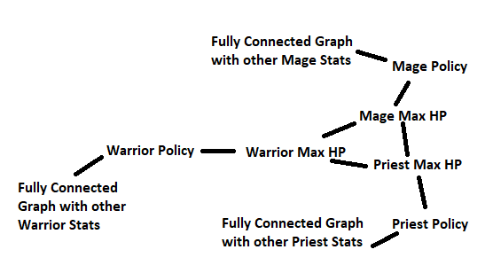

# myersoncoop
Repository of the paper: **_Towards a more efficient computation of individual attribute and policy contribution for post-hoc explainable multi-agent systems using Myerson values_**

Look at .sh files to run the scripts

Compute the Myerson Values (Shapleys on a graph) of both the Policy and stats of a 3v3 "arena" game.

# Experiments' reproduction
In order to reproduce the experiments run the scripts in the .sh files coop_xy.sh
Where x is the policy of team A (r = random, s = smart, n = noop), and likewise y is the policy of team B.

e.g. in coop_ss.sh you will find:
```console
python -W ignore main.py --exact 15 --full 1 --sim_num 72 --pol_a smart --pol_b smart
```
This will generate two .json files and two .npz files containing the results.
Once you ran the experiments for all combinations of policies, put the output in the folder statisticaltests to analyze the results with results_table.py that generates a latex table with the statistical difference between the importance of the given feature and zero, and  will also compare Myerson and Shapley outputs.

# Game Description
This game is inspired by World of Warcraft 3v3 arenas.

Two teams made by a Warrior, a Mage and a Priest fight each other.

The teams perform their sequence of actions by turn.

At the beginning of each fight, one team is chosen to start first.

The priority of action in every team is the following: 1) Warrior, 2) Mage, 3) Priest


# Role Description
Every player has a **_policy_** and a set of stats:
1. Maximum Health Points
2. Attack Power
3. Healing Power
4. Control Chance
## Warrior
The warrior can only _attack_ an enemy player.

He damages the enemy by an amount equal to his **Attack Power**.
## Mage
A mage can only _control_ (put to sleep) an enemy player.

His chance of controlling the enemy is equal to his **Control Chance**  * (1 + **Attack Power**/20)

When an enemy player is put to sleep he can not perform any action during the next turn.

## Priest
A priest can only _heal_ a teammate.

He heals the teammate by an amount equal to his **Healing Power**

# Policies
Four different policies are enabled: 1) Random 2) Smart 3) No-op 4) Deep RL (A2C)

## Random Policy
With this policy the target of the warrior and the mage are uniformly chosen between the alive enemies.
The target of the priest is chosen between the alive teammates.

## Smart Policy
The Warrior and Mage target the enemies with this priority list: 1) Priest, 2) Mage, 3) Warrior
The Priest always heals the teammate with the least HP.

## No-op Policy
No agent can act.

## RL Policy
The agents act following the output of a Deep RL trained algorithm (StableBaselines3's A2C).

# Experiment Setup
The Mayerson Values for the following characteristics are computed:
1. Warrior Maximum Health Points
2. Warrior Policy
3. Warrior Attack Power
4. Warrior Healing Power
5. Warrior Control Chance
6. Mage Maximum Health Points
7. Mage Policy
8. Mage Attack Power
9. Mage Healing Power
10. Mage Control Chance
11. Priest Maximum Health Points
12. Priest Policy
13. Priest Attack Power
14. Priest Healing Power
15. Priest Control Chance

When a characteristic is not present in a coalition it is put to 0.
When a policy is not present in a coalition the agent does not perform any action.

## Shapley vs Myerson
Computing the Shapley Values for this set of characteristics is already computationally expensive given the huge number
of possible coalitions.

But knowing a-priori something about the structure of the game allows us to build up a graph and to compute the Myerson
values on this graph. Note that in order to compute the Meyerson values you sum the utility functions of every **_connected_**
components in a coalition. This greatly reduces the complexity of the approach.

## The graph for this problem
Since when the player max HP is put to 0 he is dead and when the policy is not present the player does not act, we can
build the following graph for the game:


It is clear that when one the Max HP of a player is not in a coalition, all the branch linked to it do not contribute to
the coalition utility (the same works for the Policy).

## Copyright
Copyright 2022 Giorgio Angelotti


